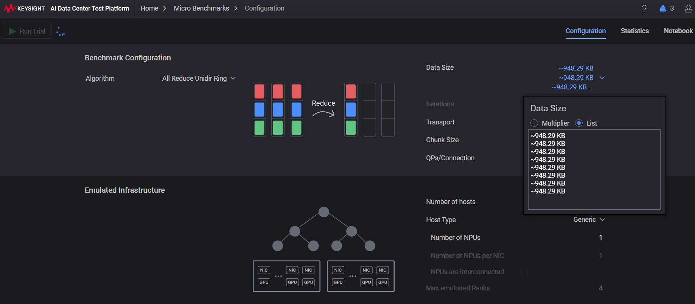
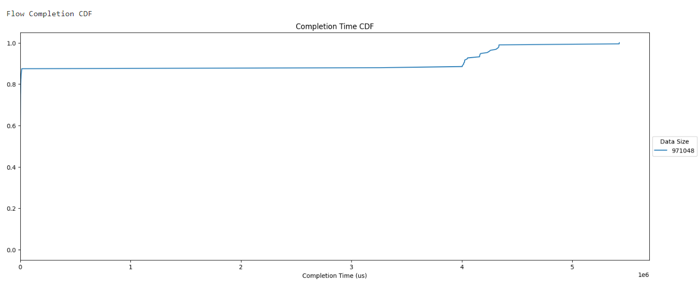
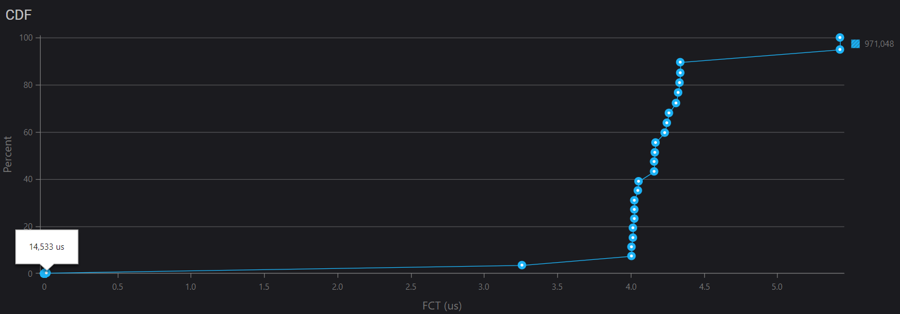

# Data Parallelism

[picture from](https://www.youtube.com/watch?v=GjbsCzYwh24&t=1s)

To achieve data parallelism with ring all-reduce using NCCL backend:

1.  **Data Splitting**: The entire dataset is split into smaller chunks or minibatches.
2.  **Model Replication**: A copy of the AI model is replicated on each machine or processing unit.
3.  **Ring All-Reduce**: Each machine processes its assigned minibatch and performs forward and backward passes
independently. The gradients are then aggregated using a ring all-reduce operation, which involves the following
steps:

- **Gradient Collection**: Each machine collects the gradients from its local minibatch.
- **Ring Communication**: Machines communicate with their neighbors in a ring topology to share the gradients.
- **All-Reduce**: The shared gradients are aggregated across the entire network using an all-reduce operation, which combines the gradients from each machine.
4.  **Model Update**: The aggregated gradients are used to update the AI model parameters.

## Trials

When loading data with a batch size, you'll obtain the batch count, which determines how many data samples are
processed in parallel during training. In other words, this represents the number of trials where data flows
through your model at once.

After each trial, collective communication events occur, facilitating synchronization and coordination among the
GPUs involved in the training process.

Below, you'll find [code snippets](MNIST/data_parallel.ipynb) that demonstrate how to obtain the batch count when loading data.

The number of trials for emulation should correspond to the product of the batch count and epoch count.

    trails = batch_count * epochs

## Collective data size

The collective data size corresponds to the sizes of the weight and bias gradients. Before exploring this
further, let's examine how to obtain the tensor data size through code examples.

    def get_tensor_data_size(t):
        return t.nelement() * t.element_size()

When training your network, the collective data size can be calculated by summing the sizes of the weight and
bias gradients.

    data_size += get_tensor_data_size(model.fc1.weight.grad)
    data_size += get_tensor_data_size(model.fc1.bias.grad)

See [Model definition and gradient data size](MNIST/data_parallel.ipynb) in notebook.

The data size for data parallel is the sum of all layer gradients data size, which is

    Data size of collective: 971048

## Emulation setting

To evaluate the fabric environment before scaling up to multiple GPUs, 
you can emulate a collective workflow with KCCB. 
This allows you to assess the performance of your setup without incurring 
significant overheads.

Open KCCB application, click `Data Size` and make a list with numbers of trials

    data_size = 971048
    trial = 8 (1 epoch)

The algorithm is modified to use `Ring all reduce` for data parallel 
and an emulated infrastructure is established with 4 GPUs, 
each located on a separate host, allowing for a distributed computing setup.
Then run trial.

## Emulation result

In many cases, there is a significant delay of approximately 14+ milliseconds
when performing collective operations within the tested fabric. However, it's not uncommon for this delay to be
accompanied by a longer tail of up to 5 seconds in some instances.

