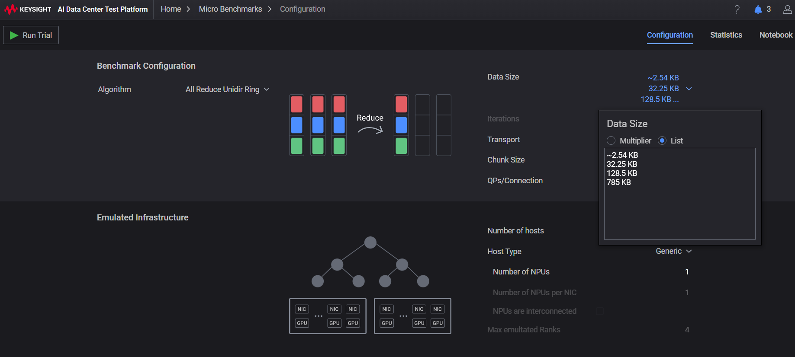
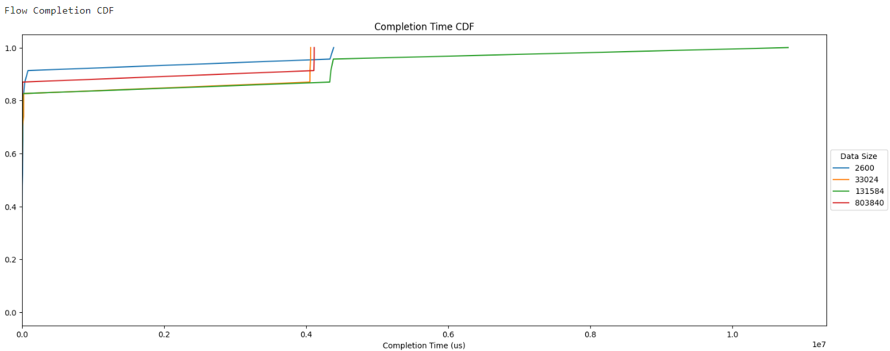
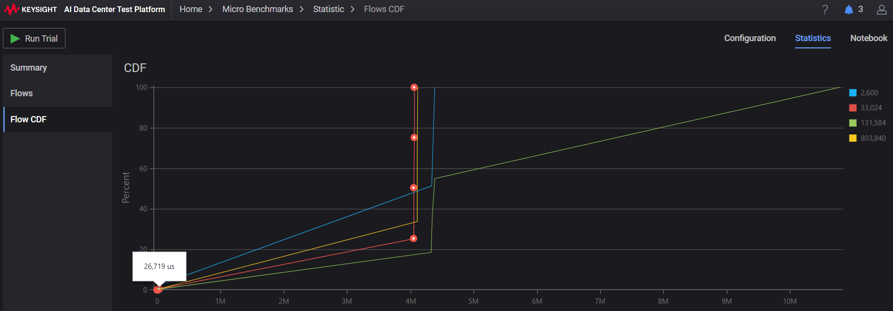

# Pipeline Parallelism

[picture from](https://www.youtube.com/watch?v=GjbsCzYwh24&t=1s)

To achieve pipeline parallelism

**Step 1: Initialize Model Instances**

* Create `n` model instances on separate nodes.
* Each node initializes its own model instance and prepares for training.

**Step 2: Forward Pass (Data Processing)**

* Each node processes its local data and computes intermediate results.
* This step is typical of most ML algorithms, such as forward passes in neural networks or feature extraction in
computer vision.

**Collective Step**

* Each node sends its intermediate results to the next node in the ring (forward pass).
* The receiving node accumulates the data and sends it to the next node in the ring (backward pass).
* This process continues until all nodes have received the final results.

**Step 3: Backward Pass (Gradient Computation)**

* Each node receives the final results from the previous node.
* It computes its own gradient using the received results.
* This step is typical of most ML algorithms, such as backward passes in neural networks or error computation in
computer vision.

**Collective Step: Ring All-Reduce (Again!)**

* Each node sends its gradients to the next node in the ring (forward pass).
* The receiving node accumulates the data and sends it to the next node in the ring (backward pass).
* This process continues until all nodes have received the final gradient results.

**Step 4: Model Update**

* Each node receives the final gradient results from the previous node.
* It updates its model instance using the received gradients.
* This step is typical of most ML algorithms, such as updating model weights or biases in neural networks.

By performing Ring All-Reduce collectives at specific steps (forward pass and backward pass), we can efficiently
achieve pipeline parallelism while minimizing communication overhead.

## Trials

When loading data with a batch size, you'll obtain the batch count, which determines how many data samples are
processed in parallel during training. In other words, this represents the number of trials where data flows
through your model at once.

After each trial, collective communication events occur, facilitating synchronization and coordination among the
GPUs involved in the training process.

Below, you'll find [code snippets](MNIST/pipeline.ipynb) that demonstrate how to obtain the batch count when loading data.

The number of trials for emulation should correspond to the product of the batch count and epoch count.

    trails = batch_count * epochs

### Collective data size

The collective data size corresponds to the sizes of the weight and bias gradients. Before exploring this
further, let's examine how to obtain the tensor data size through code examples.

    def get_tensor_data_size(t):
        return t.nelement() * t.element_size()

When training your network, the collective data size can be calculated by summing the sizes of the weight and
bias gradients.

    data_size += get_tensor_data_size(model.fc1.weight.grad)
    data_size += get_tensor_data_size(model.fc1.bias.grad)

See [Model definition and gradient data size](MNIST/pipeline.ipynb) in notebook.

There are parallelism during forward pass. Could be Intra-operator parallelism or 
Inter-operator parallelism.

Intra-operator parallelism: This approach partitions individual 
layers or computational operators of the model. 
Communication is required to transform tensors between 
different distributed layouts within a device mesh.

Inter-operator parallelism: Here, the computational graph 
itself is partitioned. Communication is needed 
to exchange full tensors between pairs of devices.

Both intra-op and inter-op communication can be
implemented using existing collective and 
point-to-point communication primitives

To make it simple, we get those data sizes
in [notebook](MNIST/pipeline.ipynb) but not take them into emulation of collectives.

The data size for different layer gradients `[fc1, fc2, fc3, fc4]` are 

        Data size of collective: [803840, 131584, 33024, 2600]

### Emulation setting

To evaluate the fabric environment before scaling up to multiple GPUs, 
you can emulate a collective workflow with KCCB. 
This allows you to assess the performance of your setup without incurring 
significant overheads.

When collective happens in backpropagation, you get last layer collective first.

Open KCCB application, click `Data Size` and make a list with numbers of trials

    data_size = [fc4, fc3, fc2, fc1]
    trial = 1 # change it to batch_count * epochs for a full emulation

The algorithm is modified to use `Ring all reduce` for pipeline parallel 
and an emulated infrastructure is established with 4 GPUs, 
each located on a separate host, allowing for a distributed computing setup.
Then run trial.

### Result

You can get performance on each layer, with observation one of them.
In many cases, there is a significant delay of approximately 20+ milliseconds
when performing collective operations within the tested fabric. However, it's not uncommon for this delay to be
accompanied by a longer tail of up to 4 or 12 seconds in some instances.

