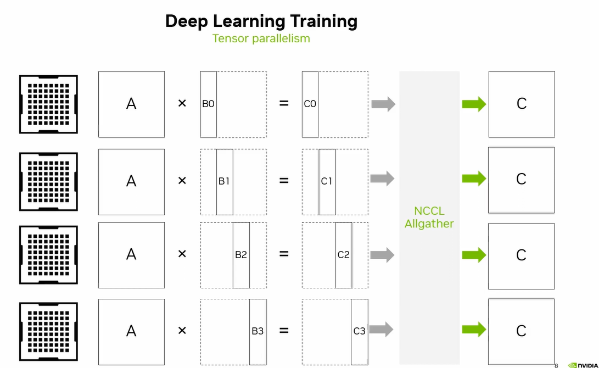
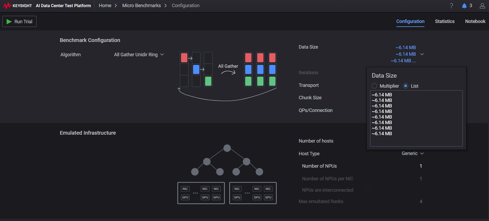
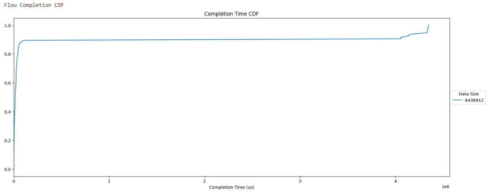
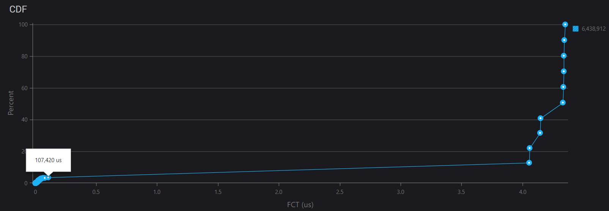

# Tensor parallel

[picture from](https://www.youtube.com/watch?v=GjbsCzYwh24&t=1s)

**Tensor Parallel Process:** A step-by-step guide to understanding how tensor parallelism works:

**1. Tensor Partitioning:**
* Divide the input tensor into smaller sub-tensors  (tiles) that can fit in memory.
* Each tile represents a portion of the original tensor.

**2. Processor Allocation:**
* Assign each tile to a processing unit  (e.g., GPU, CPU, or accelerator).
* Ensure that each processor has a sufficient number of tiles to process efficiently.

**3. Local Processing:**
* Each processing unit processes its assigned tiles independently using local memory and processing resources.
* This is where the majority of computation takes place.

**4. Data Movement:**
* As needed, move data between processors  (e.g., when one processor completes a task and needs to pass the result
to another processor).
* Minimize data movement by reordering computations or using efficient data transfer mechanisms.

**5. Synchronization:**
* Periodically synchronize processors to ensure that each tile is processed correctly and efficiently.
* This involves exchanging information between processors, such as intermediate results or gradients.

**6. Gradient Aggregation:**
* Combine the gradients from each processor into a single aggregated gradient.
* This step is crucial for updating model parameters during backpropagation.

**7. Model Update:**
* Use the aggregated gradient to update the model parameters.
* This step can be performed in parallel across multiple processors.

## Trials

When loading data with a batch size, you'll obtain the batch count, which determines how many data samples are
processed in parallel during training. In other words, this represents the number of trials where data flows
through your model at once.

After each trial, collective communication events occur, facilitating synchronization and coordination among the
GPUs involved in the training process.

Below, you'll find [code snippets](MNIST/tensor_parallel.ipynb) that demonstrate how to obtain the batch count when loading data.

The number of trials for emulation should correspond to the product of the batch count and epoch count.

    trails = batch_count * epochs

### Collective data size

The collective data size corresponds to the sizes of the weight and bias gradients. Before exploring this
further, let's examine how to obtain the tensor data size through code examples.

    def get_tensor_data_size(t):
        return t.nelement() * t.element_size()

When training your network, the data size can be calculated by summing the sizes of the input data and
labels.

    data_size += get_tensor_data_size(images)
    data_size += get_tensor_data_size(labels)

See [Model definition and gradient data size](MNIST/tensor_parallel.ipynb) in notebook.

The data size for tensor parallel is the data size divided by num of GPUs for tensor parallel.

    Data size of collective is: 6438912.0

## Emulation setting

To evaluate the fabric environment before scaling up to multiple GPUs, 
you can emulate a collective workflow with KCCB. 
This allows you to assess the performance of your setup without incurring 
significant overheads.

Open KCCB application, click `Data Size` and make a list with numbers of trials

    data_size = 6438912 (4 GPUs)
    trial = 8 (1 epoch)

The algorithm is modified to use `Ring all gather` for tensor parallel 
and an emulated infrastructure is established with 4 GPUs, 
each located on a separate host, allowing for a distributed computing setup.
Then run trial.

## Emulation result

In many cases, there is a significant delay of approximately 100+ milliseconds
when performing collective operations within the tested fabric. However, it's not uncommon for this delay to be
accompanied by a longer tail of up to 4+ seconds in some instances.

